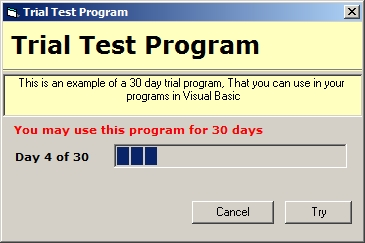



## A 30 Day Trial Example

### Description

This beginner code shows how to add a basic trial system to your programs, it can even tell if the date has also been set forward or backwards. anyway this was made for a beginner so i hope you find some of it usfull.
 
### More Info
 

             |
---                |---
**Submitted On**   |2009-07-02 08:50:02
**By**             |[dreamvb](https://github.com/Planet-Source-Code/PSCIndex/blob/master/ByAuthor/dreamvb.md)
**Level**          |Beginner
**User Rating**    |4.7 (14 globes from 3 users)
**Compatibility**  |VB 6\.0
**Category**       |[Miscellaneous](https://github.com/Planet-Source-Code/PSCIndex/blob/master/ByCategory/miscellaneous__1-1.md)
**World**          |[Visual Basic](https://github.com/Planet-Source-Code/PSCIndex/blob/master/ByWorld/visual-basic.md)
**Archive File**   |[A\_30\_Day\_T215636722009\.zip](https://github.com/Planet-Source-Code/dreamvb-a-30-day-trial-example__1-72227/archive/master.zip)

